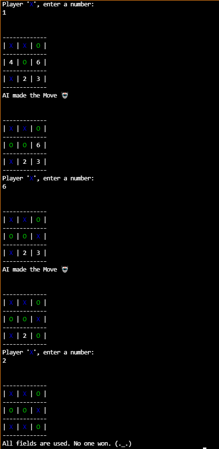

# rust tic-tac-toe

## DISCLAMER
Thanks to Flofriday for providing with the scaffolding of the tictactoe game. Check out his work [here](https://github.com/flofriday/tictactoe/releases).
I have added an enemy AI player which is truly undefeatable. It can either tie or win(if you make mistakes).
Tictactoe is small game with limited possibilities, hence the strategies can be hardcoded. 

## Future Goals
Would like to implement backtracking algorithm for the AI, to reduce code.

## Build
1. Clone the project with git or Download.
2. [Install rust](https://www.rust-lang.org/en-US/install.html), if you have not already
3. Run `cargo run --release`
